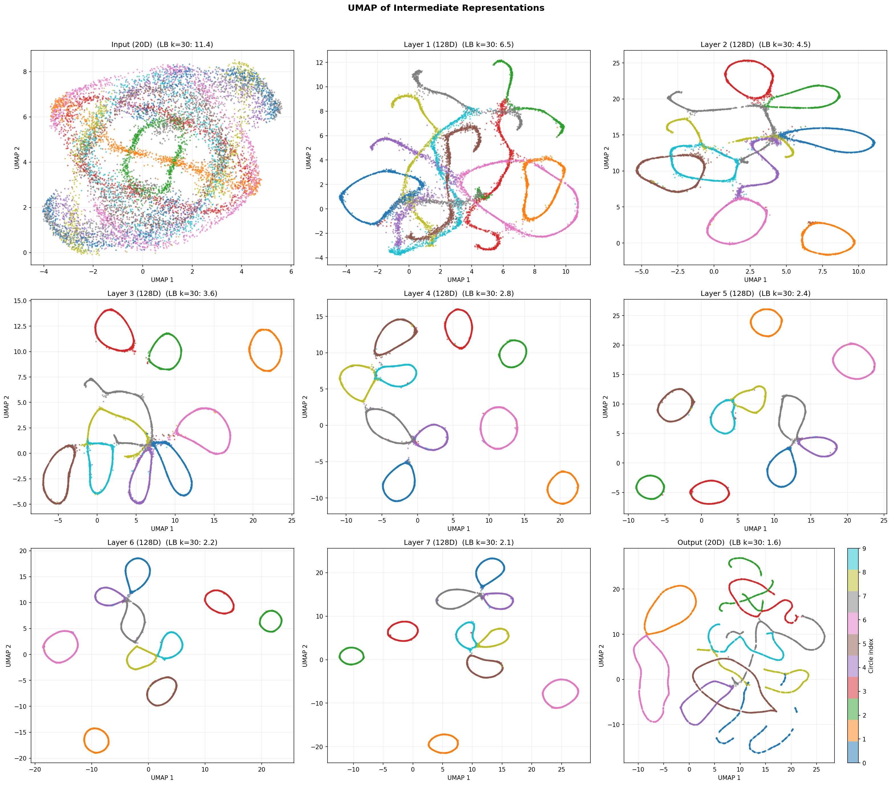

# MambaSynth: Causal Mamba for Synthetic Time Series

Causal next-step prediction on synthetic time series using the [Mamba](https://arxiv.org/abs/2312.00752) selective state space model.

A Markov-switching process generates multi-dimensional time series from overlapping oscillatory circles. A Mamba model learns to predict the next time step autoregressively, building increasingly compressed representations of the underlying state space across its layers.



## Setup

```bash
python -m venv venv
source venv/bin/activate
pip install torch numpy matplotlib umap-learn scikit-learn
```

### Building the Mamba CUDA Kernel for RTX 5090 (Blackwell / sm_120)

The `mamba-ssm` package ships custom CUDA kernels (`selective_scan` and `causal_conv1d`) that must be compiled from source for Blackwell GPUs. Pre-built wheels do not exist for compute capability 12.0, and PyTorch's bundled CUDA runtime does not include `nvcc`, so a full CUDA toolkit is required.

**1. Install the CUDA 12.8 toolkit** (first version with Blackwell / sm_120 support):

```bash
wget https://developer.download.nvidia.com/compute/cuda/repos/ubuntu2404/x86_64/cuda-keyring_1.1-1_all.deb
sudo dpkg -i cuda-keyring_1.1-1_all.deb
sudo apt update
sudo apt install -y cuda-toolkit-12-8
```

This installs `nvcc` to `/usr/local/cuda-12.8/bin/nvcc` (~2-3 GB download).

**2. Build `causal-conv1d`** (Mamba dependency):

```bash
export CUDA_HOME=/usr/local/cuda-12.8
export TORCH_CUDA_ARCH_LIST="12.0"
pip install causal-conv1d
```

**3. Clone and build `mamba-ssm` from source:**

```bash
git clone https://github.com/state-spaces/mamba.git /tmp/mamba
cd /tmp/mamba
export CUDA_HOME=/usr/local/cuda-12.8
export TORCH_CUDA_ARCH_LIST="12.0"
pip install -e .
```

The CUDA kernel compilation takes 5-10 minutes. The `setup.py` in `mamba-ssm >= 2.3.0` already handles sm_120 for CUDA 12.8+, so no source patching is needed.

**4. Verify:**

```bash
python -c "
from mamba_ssm import Mamba
import torch
m = Mamba(d_model=128, d_state=16, d_conv=4, expand=2).cuda()
x = torch.randn(2, 512, 128).cuda()
y = m(x)
print(f'OK: {tuple(x.shape)} -> {tuple(y.shape)}')
"
```

**Why not `pip install mamba-ssm` directly?** The pip package requires `nvcc` at build time. Without a system CUDA toolkit, the build fails with `bare_metal_version` undefined in `setup.py`. The `nvidia-cuda-nvcc-cu12` pip package is misleadingly named -- it contains `ptxas` but not the actual `nvcc` compiler. A full toolkit install via apt is the only reliable path.

**Why CUDA 12.8?** Earlier toolkit versions (e.g., 12.0 from `nvidia-cuda-toolkit` in Ubuntu's default repos) do not support Blackwell's sm_120 compute capability. CUDA 12.8 is the minimum version that can compile kernels for RTX 5090.

## Data Generation

Generate synthetic Markov-switching circle time series:

```bash
python markov_circles_timeseries.py
```

This creates `data/data.npz` and `data/config.json`.

## Training

Train the causal Mamba next-step prediction model:

```bash
python masked_model_gpu_mamba_next.py \
    --d-state 32 --seq-len 1024 --stride 256 \
    --no-compile --no-train-eval
```

### Ablation Flags

Scale or freeze Mamba's internal parameters to study their contribution:

```bash
# Freeze input-dependent gating (x_proj, dt_proj) -- approximates LTI / S4-like model
python masked_model_gpu_mamba_next.py \
    --gate-lr-factor 0 --d-state 32 --seq-len 1024 --stride 256 \
    --no-compile --no-train-eval --checkpoint model_next_frozen_gates.pt

# Freeze state transition matrix A_log
python masked_model_gpu_mamba_next.py \
    --freeze-A --d-state 32 --seq-len 1024 --stride 256 \
    --no-compile --no-train-eval --checkpoint model_next_freezeA.pt

# Freeze both gates and A -- reservoir computing mode (see below)
python masked_model_gpu_mamba_next.py \
    --gate-lr-factor 0 --freeze-A --d-state 32 --seq-len 1024 --stride 256 \
    --no-compile --no-train-eval --checkpoint model_next_freezeA_gates.pt
```

### Multi-Horizon Loss

Train with multi-scale prediction horizons (1, 2, 4, 8, ... up to N) to encourage the model to capture slow dynamics:

```bash
python masked_model_gpu_mamba_next.py \
    --d-state 32 --seq-len 1024 --stride 256 \
    --no-compile --no-train-eval --max-horizon 64
```

## Evaluation

UMAP visualisation and Levina-Bickel intrinsic dimension estimation across all layers:

```bash
python evaluate_representations.py --checkpoint model_next.pt
python evaluate_representations.py --checkpoint model_next.pt --pca 20
```

## Generation

Autoregressive generation from a seed context:

```bash
python generate.py --checkpoint model_next.pt --seed-len 64 --gen-len 512
python generate.py --checkpoint model_next.pt --gen-len 2048 --temperature 0.5
```

Hidden-state perturbation bursts to encourage state transitions during generation:

```bash
python generate.py --checkpoint model_next.pt --gen-len 2048 \
    --perturb-hidden --perturb-interval 200 --perturb-scale 50 --perturb-duration 10
```

## Gate Visualisation

Visualise internal Mamba gating signals (delta, z, B, C) as heatmaps or UMAPs:

```bash
python visualize_gates.py --checkpoint model_next.pt --layer 7 --sample 0
python visualize_gates.py --checkpoint model_next.pt --umap
```

## Model Architecture

- **Input projection**: Linear(feature_dim → d_model)
- **N Mamba layers**: Pre-norm → Mamba block (selective SSM) → Dropout → Residual
- **Output head**: LayerNorm → Linear(d_model → d_ff) → GELU → Linear(d_ff → feature_dim)

Default configuration: d_model=128, 7 layers, d_state=32, ~982K parameters.

## Reservoir Computing Ablation: Mamba as a Liquid State Machine

Freezing all of Mamba's SSM-specific parameters (`--gate-lr-factor 0 --freeze-A`) turns the model into a deep reservoir computer. The SSM recurrence runs with fixed, random dynamics while only the surrounding projections learn.

### Frozen model equations

With `--gate-lr-factor 0 --freeze-A`, frozen parameters are marked with a snowflake (❄) and learnable parameters with a flame (🔥). All operations are per time step $t$ within a single Mamba block.

**Global input projection** (🔥 learnable):

$$u_t = W_{\text{in}} \, x_t + b_{\text{in}}$$

**Per layer** $\ell = 1, \ldots, L$:

Pre-norm (🔥 learnable $\gamma, \beta$):

$$\tilde{u}_t = \text{LayerNorm}(u_t^{(\ell)})$$

Input split via learned projection (🔥 learnable $W_{\text{inproj}} \in \mathbb{R}^{2D_{\text{inner}} \times D_{\text{model}}}$):

$$[x_t, \; z_t] = W_{\text{inproj}} \, \tilde{u}_t$$

Causal convolution (🔥 learnable, depthwise, kernel size 4):

$$x'_t = \text{SiLU}\!\Big(\text{Conv1d}(x)_t\Big)$$

Random gating projections (❄ frozen $W_x, W_\delta, b_\delta$):

$$[\delta_r, \; B_t, \; C_t] = W_x \; x'_t$$

$$\delta_t = \text{softplus}(W_\delta \; \delta_r + b_\delta)$$

SSM recurrence (❄ frozen $A_{\log}$, diagonal negative reals):

$$A = -\exp(A_{\log})$$

$$h_t = \exp(\delta_t \odot A) \odot h_{t-1} \;+\; (\delta_t \odot B_t) \odot x'_t$$

$$y_t = C_t \cdot h_t \;+\; D \odot x'_t \qquad \text{(🔥 learnable } D \text{)}$$

Output gating and back-projection (🔥 learnable $W_{\text{out}}$):

$$o_t = y_t \odot \text{SiLU}(z_t)$$

$$r_t = W_{\text{out}} \; o_t$$

Residual connection:

$$u_t^{(\ell+1)} = u_t^{(\ell)} + r_t$$

**Global output head** (🔥 learnable):

$$\hat{x}_{t+1} = W_2 \; \text{GELU}(W_1 \; \text{LayerNorm}(u_t^{(L)}) + b_1) + b_2$$

### What's frozen vs. learnable

The frozen parameters define the SSM dynamics. Even though $\delta_t$, $B_t$, and $C_t$ are computed from the input $x'_t$, they pass through frozen random projections ($W_x$, $W_\delta$) that cannot adapt. The state transition matrix $A$ is also frozen. This means the recurrence has fixed, random temporal dynamics -- a random nonlinear reservoir.

The learnable parameters surround the reservoir:

| Component | Parameters | Role |
|-----------|-----------|------|
| $W_{\text{inproj}}$ (🔥) | 65,536 / layer | Controls what enters the SSM ($x$ branch) and what gates the output ($z$ branch) |
| Conv1d (🔥) | 1,280 / layer | Local temporal smoothing before the SSM |
| $W_{\text{out}}$ (🔥) | 32,768 / layer | Projects gated SSM output back to model dimension |
| $D$ (🔥) | 256 / layer | Skip connection weight past the SSM |
| LayerNorm (🔥) | 256 / layer | Pre-norm per layer |
| $W_{\text{in}}, b_{\text{in}}$ (🔥) | 2,688 | Global input projection (20D → 128D) |
| $W_1, b_1, W_2, b_2$ (🔥) | 76,308 | Global output head (128D → 512D → 20D) |
| **Total learnable** | **779,924** | **79.4% of all parameters** |
| $W_x$ (❄) | 18,432 / layer | Random projection to $\delta$, $B$, $C$ |
| $W_\delta, b_\delta$ (❄) | 2,304 / layer | Random discretization step projection |
| $A_{\log}$ (❄) | 8,192 / layer | Random state transition decay rates |
| **Total frozen** | **202,496** | **20.6% of all parameters** |

### Connection to Liquid State Machines

The frozen Mamba model closely parallels the [Liquid State Machine](https://doi.org/10.1162/089976602760407955) (Maass, 2002) and [Echo State Network](https://www.ai.rug.nl/minds/uploads/EchoStatesTechRep.pdf) (Jaeger, 2001) paradigms:

| | Classical Reservoir | Frozen Mamba |
|---|---|---|
| Recurrent core | Fixed random RNN | Fixed random SSM ($A$, $B$, $C$, $\delta$ frozen) |
| Input encoding | Random (fixed) | **Learned** ($W_{\text{inproj}}$, Conv1d) |
| Readout | Trained linear layer | **Learned** ($W_{\text{out}}$, output head) |
| Depth | Single reservoir | **7 stacked reservoirs** with learned inter-layer routing |
| Output gating | None | **Learned** multiplicative $z$-gate (SiLU) |
| Temporal modes | Coupled (dense connectivity) | Independent (diagonal $A$: 256 channels $\times$ 32 states = 8,192 modes/layer) |

The key upgrades over a classical reservoir are: (1) **learned input encoding** -- $W_{\text{inproj}}$ learns which linear combinations of the representation to inject into which reservoir channels, aligning inputs with the most useful temporal modes; (2) **depth** -- seven reservoirs stacked with learned projections between them, far more expressive than a single reservoir; (3) **multiplicative gating** -- the $z$-gate lets the model suppress or amplify specific reservoir channels per position.

### Result

The frozen model learns representations that are qualitatively comparable to the full Mamba model. UMAP visualisation shows clean circle separation emerging across layers, with Levina-Bickel intrinsic dimension dropping from 11.4 (input) to 4.4 (layer 7).

This suggests that for this task, Mamba's selectivity (input-dependent gating) is not critical. The random SSM provides a sufficiently rich bank of temporal mixing patterns -- 7 layers $\times$ 8,192 independent temporal modes = 57,344 random temporal features -- that the learned projections can select from. The model effectively learns to *route information through* fixed random temporal filters, consistent with the [random features](https://papers.nips.cc/paper/2007/hash/013a006f03dbc5392effeb8f18fda755-Abstract.html) framework (Rahimi & Recht, 2007).

## Files

| File | Description |
|------|-------------|
| `masked_model_gpu_mamba_next.py` | Main training script (causal Mamba model) |
| `generate.py` | Autoregressive generation with perturbation support |
| `evaluate_representations.py` | UMAP + Levina-Bickel evaluation |
| `visualize_gates.py` | Mamba gate visualisation (heatmaps + UMAP) |
| `dataset.py` | Sliding-window dataset loader |
| `estimate_dimension.py` | Levina-Bickel intrinsic dimension estimator |
| `markov_circles_timeseries.py` | Synthetic data generator |
