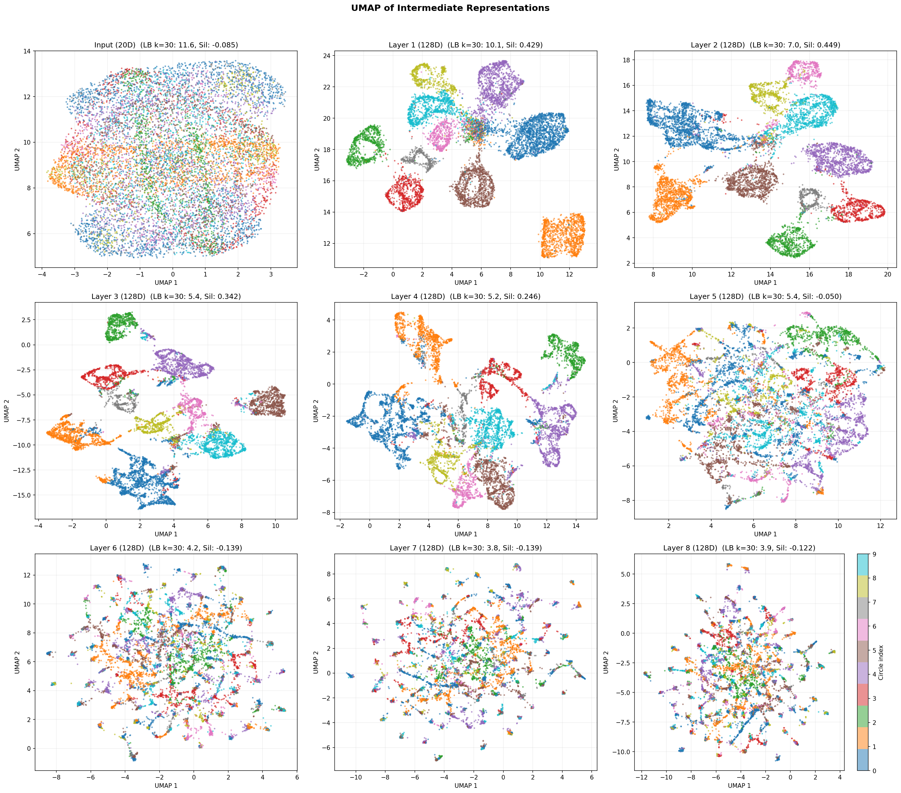

# MambaSynth: Causal Mamba for Synthetic Time Series

Causal next-step prediction on synthetic time series using the [Mamba](https://arxiv.org/abs/2312.00752) selective state space model.

A Markov-switching process generates multi-dimensional time series from overlapping oscillatory circles. A Mamba model learns to predict the next time step autoregressively, building increasingly compressed representations of the underlying state space across its layers.



The figure above shows UMAP projections of each Mamba layer's internal representations, colored by the true Markov state (circle index). The input is a noisy 20D mixture of 10 overlapping oscillatory circles with random-walk drift on the centers. By Layer 5, the model has learned to separate all 10 circles into distinct clusters (silhouette score 0.609), despite never receiving state labels during training. This is the output of:

```bash
python mamba_jepa.py --strides 4 --predictor-mlp --epochs 1000 --no-compile --stride 32 --seq-len 1024
```

## Setup

```bash
python -m venv venv
source venv/bin/activate
pip install torch numpy matplotlib umap-learn scikit-learn
```

### Building the Mamba CUDA Kernel for RTX 5090 (Blackwell / sm_120)

The `mamba-ssm` package ships custom CUDA kernels (`selective_scan` and `causal_conv1d`) that must be compiled from source for Blackwell GPUs. Pre-built wheels do not exist for compute capability 12.0, and PyTorch's bundled CUDA runtime does not include `nvcc`, so a full CUDA toolkit is required.

**1. Install the CUDA 12.8 toolkit** (first version with Blackwell / sm_120 support):

```bash
wget https://developer.download.nvidia.com/compute/cuda/repos/ubuntu2404/x86_64/cuda-keyring_1.1-1_all.deb
sudo dpkg -i cuda-keyring_1.1-1_all.deb
sudo apt update
sudo apt install -y cuda-toolkit-12-8
```

This installs `nvcc` to `/usr/local/cuda-12.8/bin/nvcc` (~2-3 GB download).

**2. Build `causal-conv1d`** (Mamba dependency):

```bash
export CUDA_HOME=/usr/local/cuda-12.8
export TORCH_CUDA_ARCH_LIST="12.0"
pip install causal-conv1d
```

**3. Clone and build `mamba-ssm` from source:**

```bash
git clone https://github.com/state-spaces/mamba.git /tmp/mamba
cd /tmp/mamba
export CUDA_HOME=/usr/local/cuda-12.8
export TORCH_CUDA_ARCH_LIST="12.0"
pip install -e .
```

The CUDA kernel compilation takes 5-10 minutes. The `setup.py` in `mamba-ssm >= 2.3.0` already handles sm_120 for CUDA 12.8+, so no source patching is needed.

**4. Verify:**

```bash
python -c "
from mamba_ssm import Mamba
import torch
m = Mamba(d_model=128, d_state=16, d_conv=4, expand=2).cuda()
x = torch.randn(2, 512, 128).cuda()
y = m(x)
print(f'OK: {tuple(x.shape)} -> {tuple(y.shape)}')
"
```

**Why not `pip install mamba-ssm` directly?** The pip package requires `nvcc` at build time. Without a system CUDA toolkit, the build fails with `bare_metal_version` undefined in `setup.py`. The `nvidia-cuda-nvcc-cu12` pip package is misleadingly named -- it contains `ptxas` but not the actual `nvcc` compiler. A full toolkit install via apt is the only reliable path.

**Why CUDA 12.8?** Earlier toolkit versions (e.g., 12.0 from `nvidia-cuda-toolkit` in Ubuntu's default repos) do not support Blackwell's sm_120 compute capability. CUDA 12.8 is the minimum version that can compile kernels for RTX 5090.

## Data Generation

Generate synthetic Markov-switching circle time series:

```bash
python markov_circles_timeseries.py
```

This creates `data/data.npz` and `data/config.json`.

## Training

Train the causal Mamba next-step prediction model:

```bash
python masked_model_gpu_mamba_next.py \
    --d-state 32 --seq-len 1024 --stride 256 \
    --no-compile --no-train-eval
```

### Ablation Flags

Scale or freeze Mamba's internal parameters to study their contribution:

```bash
# Freeze input-dependent gating (x_proj, dt_proj) -- approximates LTI / S4-like model
python masked_model_gpu_mamba_next.py \
    --gate-lr-factor 0 --d-state 32 --seq-len 1024 --stride 256 \
    --no-compile --no-train-eval --checkpoint model_next_frozen_gates.pt

# Freeze state transition matrix A_log
python masked_model_gpu_mamba_next.py \
    --freeze-A --d-state 32 --seq-len 1024 --stride 256 \
    --no-compile --no-train-eval --checkpoint model_next_freezeA.pt

# Freeze both gates and A -- reservoir computing mode (see below)
python masked_model_gpu_mamba_next.py \
    --gate-lr-factor 0 --freeze-A --d-state 32 --seq-len 1024 --stride 256 \
    --no-compile --no-train-eval --checkpoint model_next_freezeA_gates.pt
```

### Multi-Horizon Loss

Train with multi-scale prediction horizons (1, 2, 4, 8, ... up to N) to encourage the model to capture slow dynamics:

```bash
python masked_model_gpu_mamba_next.py \
    --d-state 32 --seq-len 1024 --stride 256 \
    --no-compile --no-train-eval --max-horizon 64
```

## Evaluation

UMAP visualisation and Levina-Bickel intrinsic dimension estimation across all layers:

```bash
python evaluate_representations.py --checkpoint model_next.pt
python evaluate_representations.py --checkpoint model_next.pt --pca 20
```

## Generation

Autoregressive generation from a seed context:

```bash
python generate.py --checkpoint model_next.pt --seed-len 64 --gen-len 512
python generate.py --checkpoint model_next.pt --gen-len 2048 --temperature 0.5
```

Hidden-state perturbation bursts to encourage state transitions during generation:

```bash
python generate.py --checkpoint model_next.pt --gen-len 2048 \
    --perturb-hidden --perturb-interval 200 --perturb-scale 50 --perturb-duration 10
```

## Gate Visualisation

Visualise internal Mamba gating signals (delta, z, B, C) as heatmaps or UMAPs:

```bash
python visualize_gates.py --checkpoint model_next.pt --layer 7 --sample 0
python visualize_gates.py --checkpoint model_next.pt --umap
```

## Model Architecture

- **Input projection**: Linear(feature_dim → d_model)
- **N Mamba layers**: Pre-norm → Mamba block (selective SSM) → Dropout → Residual
- **Output head**: LayerNorm → Linear(d_model → d_ff) → GELU → Linear(d_ff → feature_dim)

Default configuration: d_model=128, 7 layers, d_state=32, ~982K parameters.

## Reservoir Computing Ablation: Mamba as a Liquid State Machine

Freezing all of Mamba's SSM-specific parameters (`--gate-lr-factor 0 --freeze-A`) turns the model into a deep reservoir computer. The SSM recurrence runs with fixed, random dynamics while only the surrounding projections learn.

### Frozen model equations

With `--gate-lr-factor 0 --freeze-A`, frozen parameters are marked with a snowflake (❄) and learnable parameters with a flame (🔥). All operations are per time step $t$ within a single Mamba block.

**Global input projection** (🔥 learnable):

$$u_t = W_{\text{in}} \, x_t + b_{\text{in}}$$

**Per layer** $\ell = 1, \ldots, L$:

Pre-norm (🔥 learnable $\gamma, \beta$):

$$\tilde{u}_t = \text{LayerNorm}(u_t^{(\ell)})$$

Input split via learned projection (🔥 learnable $W_{\text{inproj}} \in \mathbb{R}^{2D_{\text{inner}} \times D_{\text{model}}}$):

$$[x_t, \; z_t] = W_{\text{inproj}} \, \tilde{u}_t$$

Causal convolution (🔥 learnable, depthwise, kernel size 4):

$$x'_t = \text{SiLU}\!\Big(\text{Conv1d}(x)_t\Big)$$

Random gating projections (❄ frozen $W_x, W_\delta, b_\delta$):

$$[\delta_r, \; B_t, \; C_t] = W_x \; x'_t$$

$$\delta_t = \text{softplus}(W_\delta \; \delta_r + b_\delta)$$

SSM recurrence (❄ frozen $A_{\log}$, diagonal negative reals):

$$A = -\exp(A_{\log})$$

$$h_t = \exp(\delta_t \odot A) \odot h_{t-1} \;+\; (\delta_t \odot B_t) \odot x'_t$$

$$y_t = C_t \cdot h_t \;+\; D \odot x'_t \qquad \text{(🔥 learnable } D \text{)}$$

Output gating and back-projection (🔥 learnable $W_{\text{out}}$):

$$o_t = y_t \odot \text{SiLU}(z_t)$$

$$r_t = W_{\text{out}} \; o_t$$

Residual connection:

$$u_t^{(\ell+1)} = u_t^{(\ell)} + r_t$$

**Global output head** (🔥 learnable):

$$\hat{x}_{t+1} = W_2 \; \text{GELU}(W_1 \; \text{LayerNorm}(u_t^{(L)}) + b_1) + b_2$$

### What's frozen vs. learnable

The frozen parameters define the SSM dynamics. Even though $\delta_t$, $B_t$, and $C_t$ are computed from the input $x'_t$, they pass through frozen random projections ($W_x$, $W_\delta$) that cannot adapt. The state transition matrix $A$ is also frozen. This means the recurrence has fixed, random temporal dynamics -- a random nonlinear reservoir.

The learnable parameters surround the reservoir:

| Component | Parameters | Role |
|-----------|-----------|------|
| $W_{\text{inproj}}$ (🔥) | 65,536 / layer | Controls what enters the SSM ($x$ branch) and what gates the output ($z$ branch) |
| Conv1d (🔥) | 1,280 / layer | Local temporal smoothing before the SSM |
| $W_{\text{out}}$ (🔥) | 32,768 / layer | Projects gated SSM output back to model dimension |
| $D$ (🔥) | 256 / layer | Skip connection weight past the SSM |
| LayerNorm (🔥) | 256 / layer | Pre-norm per layer |
| $W_{\text{in}}, b_{\text{in}}$ (🔥) | 2,688 | Global input projection (20D → 128D) |
| $W_1, b_1, W_2, b_2$ (🔥) | 76,308 | Global output head (128D → 512D → 20D) |
| **Total learnable** | **779,924** | **79.4% of all parameters** |
| $W_x$ (❄) | 18,432 / layer | Random projection to $\delta$, $B$, $C$ |
| $W_\delta, b_\delta$ (❄) | 2,304 / layer | Random discretization step projection |
| $A_{\log}$ (❄) | 8,192 / layer | Random state transition decay rates |
| **Total frozen** | **202,496** | **20.6% of all parameters** |

### Connection to Liquid State Machines

The frozen Mamba model closely parallels the [Liquid State Machine](https://doi.org/10.1162/089976602760407955) (Maass, 2002) and [Echo State Network](https://www.ai.rug.nl/minds/uploads/EchoStatesTechRep.pdf) (Jaeger, 2001) paradigms:

| | Classical Reservoir | Frozen Mamba |
|---|---|---|
| Recurrent core | Fixed random RNN | Fixed random SSM ($A$, $B$, $C$, $\delta$ frozen) |
| Input encoding | Random (fixed) | **Learned** ($W_{\text{inproj}}$, Conv1d) |
| Readout | Trained linear layer | **Learned** ($W_{\text{out}}$, output head) |
| Depth | Single reservoir | **7 stacked reservoirs** with learned inter-layer routing |
| Output gating | None | **Learned** multiplicative $z$-gate (SiLU) |
| Temporal modes | Coupled (dense connectivity) | Independent (diagonal $A$: 256 channels $\times$ 32 states = 8,192 modes/layer) |

The key upgrades over a classical reservoir are: (1) **learned input encoding** -- $W_{\text{inproj}}$ learns which linear combinations of the representation to inject into which reservoir channels, aligning inputs with the most useful temporal modes; (2) **depth** -- seven reservoirs stacked with learned projections between them, far more expressive than a single reservoir; (3) **multiplicative gating** -- the $z$-gate lets the model suppress or amplify specific reservoir channels per position.

### Result

The frozen model learns representations that are qualitatively comparable to the full Mamba model. UMAP visualisation shows clean circle separation emerging across layers, with Levina-Bickel intrinsic dimension dropping from 11.4 (input) to 4.4 (layer 7).

This suggests that for this task, Mamba's selectivity (input-dependent gating) is not critical. The random SSM provides a sufficiently rich bank of temporal mixing patterns -- 7 layers $\times$ 8,192 independent temporal modes = 57,344 random temporal features -- that the learned projections can select from. The model effectively learns to *route information through* fixed random temporal filters, consistent with the [random features](https://papers.nips.cc/paper/2007/hash/013a006f03dbc5392effeb8f18fda755-Abstract.html) framework (Rahimi & Recht, 2007).

## Mamba-JEPA: Self-Supervised Representation Learning

In addition to supervised next-step prediction, this repo includes a **JEPA** (Joint Embedding Predictive Architecture) variant that uses causal Mamba for self-supervised representation learning.

### Architecture

```
Context encoder : Input → Linear(D_in→D) → Mamba (N layers) → LayerNorm → D-dim reps
Target encoder  : Same architecture, EMA of context encoder (no gradients)
Predictor       : context_rep[t] → MLP or small Mamba → predicted target_rep[t+1]
Loss            : MSE(predictor(context_rep)[:-1], target_rep[1:])
```

Since Mamba is inherently causal, no masking is needed — the information asymmetry comes from causality itself. The target encoder is updated via exponential moving average (EMA) with a cosine momentum schedule from 0.996 → 1.0.

### Predictor Choice Matters

A key finding: the **predictor capacity** controls the quality of encoder representations. A weaker predictor forces the encoder to build richer, more discriminative representations since the predictor cannot compensate by modelling temporal dependencies itself.

| Predictor | Val JEPA Loss | Peak Silhouette | Best Layer |
|-----------|---------------|-----------------|------------|
| 2-layer Mamba | 0.0191 | 0.381 | Layer 7 |
| **Per-position MLP** | **0.0470** | **0.547** | **Layer 8 (norm)** |

### Comparison: Next-Step (Observation) vs Mamba-JEPA (MLP Predictor)

Both models trained on noisy Markov-switching data (stride 32, contrastive loss λ=1.0 for next-step model):

| Layer | Next-Step (obs) 200ep | MLP JEPA 200ep | MLP JEPA 1000ep |
|-------|-----------------------|----------------|-----------------|
| Input | -0.069 | -0.068 | -0.069 |
| Layer 1 | 0.220 | -0.047 | 0.199 |
| Layer 2 | 0.282 | 0.129 | 0.361 |
| Layer 3 | 0.362 | 0.211 | 0.432 |
| Layer 4 | 0.386 | 0.318 | 0.423 |
| Layer 5 | 0.404 | 0.381 | 0.438 |
| Layer 6 | **0.435** | 0.377 | 0.407 |
| Layer 7 | 0.424 | 0.386 | 0.370 |
| Layer 8 (norm) | — | 0.453 | **0.547** |

The Mamba-JEPA with MLP predictor at 1000 epochs achieves the best silhouette score (0.547), surpassing the supervised next-step prediction model (0.435) by a wide margin.

### Effect of Sequence Length

Longer sequence windows give the encoder more temporal context per window:

| seq_len | Val JEPA Loss | Peak Silhouette | Best Layer |
|---------|---------------|-----------------|------------|
| 128 | 0.0293 | 0.331 | Layer 7 |
| 512 | 0.0420 | 0.547 | Layer 8 |
| **1024** | **0.0420** | **0.599** | **Layer 8** |

Longer windows help: `seq_len=1024` reaches **0.599** silhouette on the noisy random-walk dataset. The model benefits from seeing more of each circle's trajectory within a single window.

## Multi-Scale Mamba-JEPA

A variant with **convolutional temporal downsampling** before the Mamba layers, integrated into `mamba_jepa.py` via the `--strides` flag. Each branch operates at a different temporal stride, forcing timescale separation architecturally rather than through the loss.

### Architecture

```
Single branch (stride=4):
  Input (B, T, D_in)
    → CausalConv1d(kernel=8, stride=4) → (B, T/4, D)
    → 7 Mamba layers (operating at 4× slower clock)
    → LayerNorm → upsample → (B, T, D)

Multi-branch (strides=[1, 4, 16]):
  Input (B, T, D_in)
    ├→ Branch 1: Linear         → 7 Mamba layers → (B, T, D)      [full speed]
    ├→ Branch 2: Conv(stride=4) → 7 Mamba layers → upsample (B, T, D)  [4× slower]
    └→ Branch 3: Conv(stride=16)→ 7 Mamba layers → upsample (B, T, D)  [16× slower]
  Concatenate → Linear(3D→D) + LayerNorm → (B, T, D)
```

The stride-16 branch physically cannot represent anything faster than 16-step fluctuations — the conv has averaged it away. Its Mamba layers are forced to model slow structure (circle identity, orbital phase). The stride-1 branch preserves full temporal detail.

### Best Result: Conv Stride-4 + seq_len=1024

The convolutional front-end (stride=4) combined with long context windows achieves the **best overall silhouette score of 0.609**:

| Layer | Silhouette |
|-------|-----------|
| Layer 1 | 0.396 |
| Layer 2 | 0.564 |
| Layer 3 | 0.549 |
| Layer 4 | 0.593 |
| **Layer 5** | **0.609** |
| Layer 6 | 0.588 |
| Layer 7 | 0.570 |
| Layer 8 | 0.569 |

Notably, silhouette scores are **broadly high across layers** (Layers 2-8 all above 0.54), unlike the standard JEPA which peaks sharply at one layer and drops off. The conv downsampling forces earlier compression and yields more uniformly useful representations.

### Results on High-Noise Data (noise_std=5.66, no random walk)

Single branch (stride=4), MLP predictor, seq_len=512, stride=32:

| Layer | 500 epochs | 1000 epochs |
|-------|-----------|-------------|
| Layer 3 | -0.092 | **0.503** |
| Layer 4 | -0.003 | 0.497 |
| Layer 8 | 0.359 | 0.507 |

### Multi-Branch Caveat

Multi-branch configurations (e.g., strides=[1,4,16]) suffer from a **lazy branch problem**: the stride-1 branch dominates with single-step prediction loss, making slower branches redundant. The fusion layer learns to prioritize the fast branch. Single-branch configurations with moderate stride (4) work best.

### Training

All variants run through the unified `mamba_jepa.py`:

```bash
# Best configuration (conv stride-4, long context):
python mamba_jepa.py --strides 4 --predictor-mlp --epochs 1000 \
    --no-compile --stride 32 --seq-len 1024

# Standard JEPA (no conv head):
python mamba_jepa.py --predictor-mlp --epochs 1000 --no-compile --seq-len 1024

# Multi-scale branches:
python mamba_jepa.py --strides 1,4,16 --predictor-mlp --epochs 1000 --no-compile

# Deep supervision (per-layer loss):
python mamba_jepa.py --per-layer-loss --predictor-mlp --epochs 1000 --no-compile

# Evaluate any model:
python evaluate_representations.py --checkpoint mamba_jepa_model.pt
```

## Homeostatic Pre-Activation Regularization

Extended training (e.g. 3000 epochs) causes representation **overspecialization**: the UMAP clusters collapse into stringy, tangled manifolds and silhouette scores degrade sharply (0.609 → 0.449 at Layer 2). The model overfits its temporal prediction objective at the expense of representational structure.

To combat this, we implement a **homeostatic pre-activation penalty** adapted from continual learning research. The idea is to add an L2 penalty on the hidden states at each layer boundary (before LayerNorm), driving the network toward a low-magnitude resting state:

```
L_total = L_JEPA + λ * L_homeo

L_homeo = (1/L) Σ_l mean(h_l²)
```

where `h_l` is the hidden state after the `l`-th Mamba layer (before LayerNorm), and `L` is the number of layers.

### Why pre-activation (not weights or post-norm)?

- **Weight decay** shrinks weights globally without regard to activation magnitudes.
- **Post-norm penalties** miss the information about how far the raw activations drift.
- **Pre-activation penalties** directly constrain the residual stream magnitude, preventing the hidden states from drifting to extreme values over long training. The gradient is bidirectional: strongly positive activations are pushed down, strongly negative ones are pushed up, and near-zero activations receive minimal gradient.

### Usage

```bash
# Enable with --preact-lambda (default 0 = disabled)
python mamba_jepa.py --strides 4 --predictor-mlp --epochs 1000 \
    --no-compile --stride 32 --seq-len 1024 --preact-lambda 0.001
```

The homeostatic loss is logged in a separate column during training. Start with small values (1e-4 to 1e-3) — the penalty should gently regularize without dominating the JEPA loss.

### Implementation

The penalty is computed at each encoder layer boundary:
- `MambaEncoder`: caches hidden states after each Mamba layer
- `ConvBranch`: same caching in the convolutional branch path
- `MultiScaleEncoder`: averages homeostatic loss across all branches
- `CausalMambaJEPA.homeostatic_loss()`: delegates to the context encoder (target encoder has no gradients)

## Summary of Best Results

| Model | Data | Epochs | seq_len | Peak Silhouette |
|-------|------|--------|---------|-----------------|
| **Conv stride-4 JEPA** | **noisy + random walk** | **1000** | **1024** | **0.609** |
| Standard JEPA | noisy + random walk | 1000 | 1024 | 0.599 |
| Standard JEPA | noisy + random walk | 1000 | 512 | 0.547 |
| Conv stride-4 JEPA | 2× noise, no walk | 1000 | 512 | 0.515 |
| Supervised next-step | noisy + random walk | 200 | 1024 | 0.435 |

All JEPA models use the MLP predictor. See [RESEARCH_LOG.md](RESEARCH_LOG.md) for full experiment history.

## Files

| File | Description |
|------|-------------|
| `mamba_jepa.py` | Unified Mamba-JEPA: standard, multi-scale (`--strides`), deep supervision (`--per-layer-loss`) |
| `masked_model_gpu_mamba_next.py` | Supervised next-step prediction training script |
| `mamba_jepa_multiscale.py` | Legacy multi-scale script (superseded by unified `mamba_jepa.py`) |
| `generate.py` | Autoregressive generation with perturbation support |
| `evaluate_representations.py` | UMAP + silhouette score + Levina-Bickel evaluation |
| `visualize_gates.py` | Mamba gate visualisation (heatmaps + UMAP) |
| `cluster_representations.py` | GPU spectral clustering of representations |
| `dataset.py` | Sliding-window dataset loader |
| `estimate_dimension.py` | Levina-Bickel intrinsic dimension estimator |
| `markov_circles_timeseries.py` | Synthetic data generator |
| `RESEARCH_LOG.md` | Full experiment history and architectural decisions |
